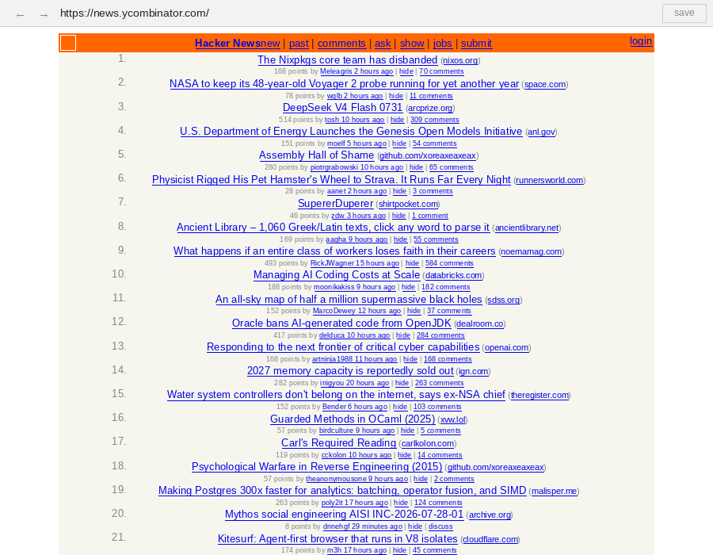
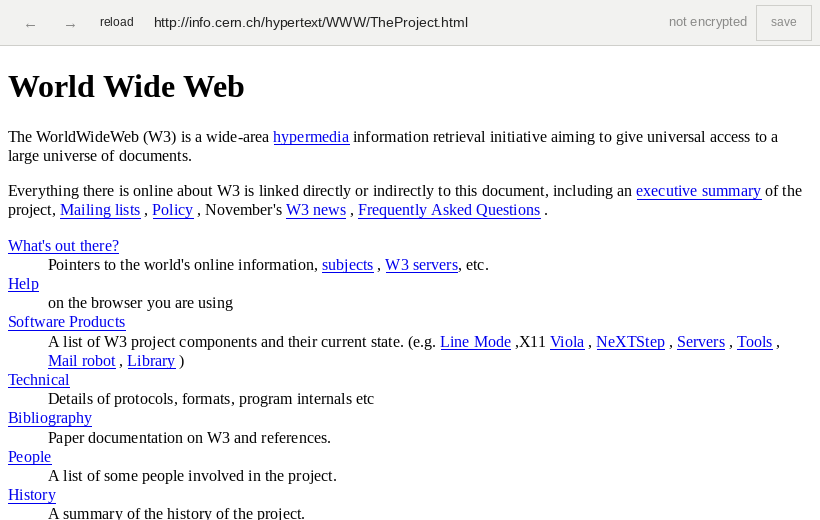
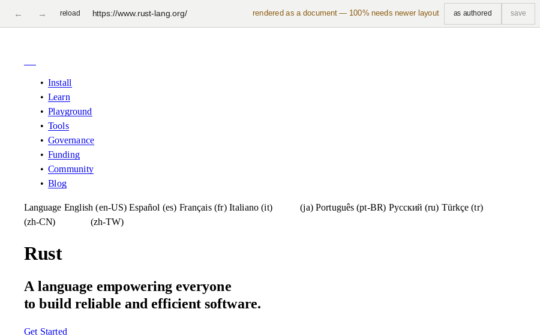
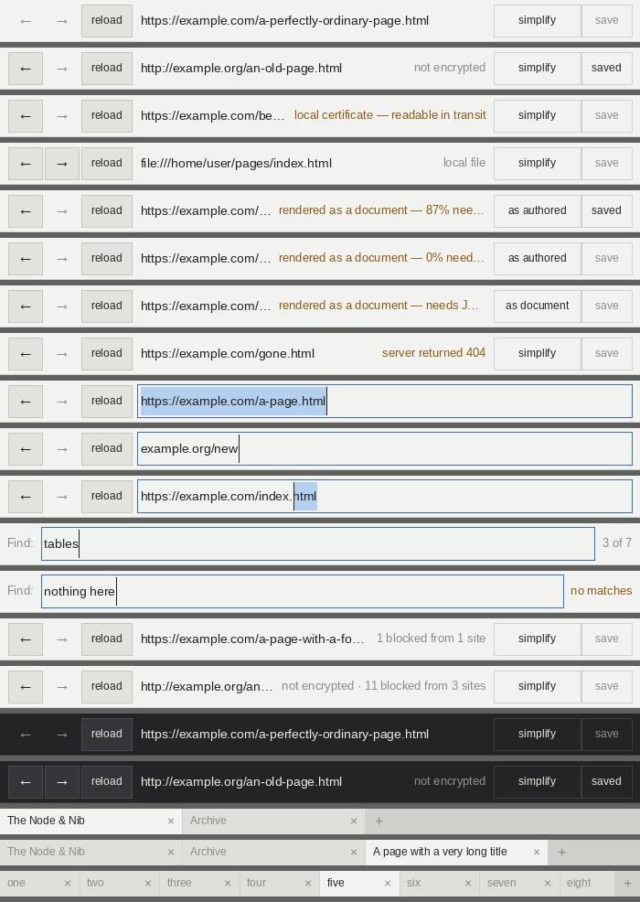

# 2kbrowser

A web browser without the slop.

2kbrowser renders HTML and CSS as the web did around the year 2000, and does not
execute JavaScript. That single constraint does most of the work: cookie walls,
newsletter modals, notification prompts, autoplay video, infinite scroll, and
tracking beacons are almost all script-delivered, so they simply do not run —
and an engine with no JavaScript has nowhere to put the usual browser bloat.

The scope boundary is **CSS 2.1**, a completed specification with an official
test suite. Unlike an engine chasing the modern web, this one has a finish line.

See [PLAN.md](PLAN.md) for the full rationale and roadmap, and
[docs/adr/](docs/adr/) for the decisions that constrain it.

## What it looks like

Real pages, screenshotted from the running browser. Regenerate them with
`scripts/screenshots.sh`.



Hacker News, today, with no JavaScript. Most of the web that is worth reading
looks like this without scripts — the constraint is the filter, not a
limitation to work around. The bar says nothing, because an ordinary page over
HTTPS has nothing to say.



The first website, still up, still plain HTTP. The bar marks it *not encrypted*
— never the reverse, because decorating the secure case teaches people to look
for a signal whose absence is easy to miss (ADR-0006).



A page built with layout this engine does not implement. Rather than render it
as jumbled boxes and let you think the browser is broken, it says what it did
and offers you the author's layout anyway (ADR-0009).



Every state the bar can be in, drawn by `cargo run -p shell --example
chrome-strip` — which is also how it is reviewed, since a headless test can
compare pixels and a person cannot compare descriptions.

## Status

**M2 — it renders the era's web.** HTML is fetched over HTTP(S) or read from
disk, parsed into an arena DOM, cascaded through a CSS 2.1 subset, laid out,
shaped against bundled Liberation faces, and rasterised on the CPU.

Working: the cascade with selectors, specificity, and inheritance; the box
model with borders and backgrounds; inline layout with per-span styles and
Unicode line breaking; floats; tables with automatic column sizing, `colspan` and `rowspan`, and
`cellspacing`; images,
including ones sitting in a line; `background-position`, including the
percentage form, which aligns a point on the image with the same point on the
box rather than offsetting from the corner; relative and absolute positioning;
framesets; quirks-mode value parsing; the presentational attributes the era's
markup actually used (`bgcolor`, `align`, `<font>`, `border`); list markers;
text decorations; tiled background images; every CSS 2.1 border style —
dotted and dashed runs stretched to start and end flush with the corners rather
than leaving half a dash there, and `double`, `groove`, `ridge`, `inset` and
`outset` lit from above and to the left, which is what made the era's grey
buttons look like buttons; external stylesheets, including
`@import` chains and `@media` blocks; and legacy
character encodings, which most of the surviving old web needs — a page in
windows-1252 read as UTF-8 is replacement characters where every accented
letter and curly quote should be.

Rendering is deterministic across Linux, macOS, and Windows, checked by
reference tests against one shared baseline set — verified, not assumed: all
three have rendered it byte for byte in CI, and so has a fourth target,
aarch64 Linux, against the same baselines.

The window opens on a virtual display in CI and is checked to survive
(`scripts/smoke-window.sh`) — which catches a panic or a bad index, though not
"does it look right". Everything with a testable shape lives outside the event
loop, and the rendering it drives is covered by the reference tests.

The CSS 2.1 suite has been run against it: **1385 of 4821 reference tests pass,
28.7%**, with no panics across roughly ten thousand renders. That is an upper
bound rather than a score — a reftest passes when both sides look the same, and
an engine that ignores a property draws both sides the same way — but the
failures are largely real: on a random sample of 150 of them, headless Chromium
renders 140 identically. `cargo run --profile conformance -p conformance` does
it; the suite is not vendored.

The first run of that reported 20.6%, and the number was wrong three times over
before it was worth anything — see PLAN.md, because the harness's own bugs are
more instructive than the figure.

Known to be missing or wrong, rather than hidden: margin collapsing does not
handle an **empty block collapsing through itself**; `overflow` is understood
only for its effect on formatting contexts, and content that overflows a box is
not clipped; an invalid selector does not invalidate its rule, so
`[1digit], div { color: red }` styles the `div` where a browser would style
nothing; collapsed borders; fixed
table layout; and `inline-block`,
which is recognised and then laid out as though it were plain `inline` — an
empty one with a width and a height collapses to nothing at all. That last one
now counts as layout this engine does not implement, alongside flex and grid,
so a page built on inline-blocks is re-rendered as a document and told so
rather than coming out subtly wrong in silence (ADR-0009). It is a share and
not a switch, so a navigation bar of them does not move an article.

Pages of any length work. The renderer paints a *band* — a few windows' worth
of rows around where you are reading — rather than the whole document, and the
rows ahead of you are asked for before you reach them, on a thread, so ordinary
scrolling never waits. The parse, the cascade, and the layout all stay done
between bands, so moving down a long page costs only the pixels. A band is
exactly the rows it names from a whole-page render, which is asserted at both
levels: against the rasteriser directly, and across a real process boundary.

Links work in the window: click to follow, Alt+Left/Right or Backspace for
back and forward, and the cursor changes over a link. `2kbrowser links <page>`
prints every link rectangle and where it leads, and
`cargo run -p shell --example link-map` draws them over the page.

There is a chrome bar. It shows the URL, marks plain HTTP as unencrypted
(never the reverse — decorating the secure case teaches people to look for a
signal whose absence is easy to miss), and says when a page was re-rendered as
a document, with a control to overrule that and see the author's layout
(ADR-0009). An ordinary page over HTTPS says nothing at all.
`cargo run -p shell --example chrome-strip` draws every state of it.

The URL bar is editable: Ctrl+L (or F6, or clicking it) focuses it with the
URL selected, Enter navigates, Escape gives up. A bare host gets `https://`,
because that is what typing `example.com` means.

Find-in-page is on Ctrl+F: matches highlight as you type, Enter and F3 step
through them (Shift to go back), and the bar counts them. A match already on
screen is not scrolled to — moving the page under someone who can see what
they were looking for is disorienting.

Tabs work: Ctrl+T opens one beside the current tab, Ctrl+W closes it,
Ctrl+Tab and Ctrl+1..9 switch, middle-click opens a link in a new one. The
strip only appears once there is a second tab — above a single tab it would be
a row of chrome that says nothing the URL bar has not already said. A tab is
named by the page's `<title>`, or by its URL when it has none.

Bookmarks are on Ctrl+D, and the bar's rightmost control says whether the page
you are on is saved. Ctrl+B opens the saved list — as a page, in a tab, because
the browser already knows how to show a document with links in it and a
bookmarks *panel* would be a second piece of interface with its own scrolling
and its own bugs. `2kbrowser bookmarks` prints the same list. It is stored as a
tab-separated file under your config directory: a few kilobytes, editable in
anything, and the only state this browser keeps between runs.

Links can be followed without a pointer: Tab walks them in document order,
Shift+Tab goes back, Enter follows, Escape drops the focus. The focused link is
outlined rather than tinted, so it does not read as a find match — both can be
on screen at once and they mean different things — and a link that wraps across
a line break is outlined in every piece, because it is one link.

M3 is complete, and M4 has started with fuzzing. `cargo test` runs a short pass
that mutates the reference fixtures into the HTML parser, the CSS parser, image
decoding, URL parsing, and the whole render pipeline; `cargo run -p fuzz` soaks
for as long as you leave it. The first soak found three panics reachable from
an ordinary stylesheet — `font-size: 0`, `font-size: 99999px`, and
`margin: 1e40px` — each of which stopped the browser. A later one found a
fourth: a glyph shifted far enough by its own run offset that the rectangle
built for it left `i32`, which the check on the text origin did not catch
because the origin was not where the glyph landed. All four are fixed, and each
has a regression test where the bug was rather than where it surfaced.

A hang is a finding too, and for a while it was the one kind the fuzzer could
not report: it times an input once it returns, and an input that never returns
is never timed — the harness hung along with it. A watchdog thread now names the
input and ends the run with its own exit status. It does not interrupt the stuck
thread, on purpose: nothing safe can, and a harness that could stop arbitrary
code at an arbitrary point is one whose findings nobody could trust.

**Everything renders in a separate process** — the window, `render`, and
`links` alike. The parent keeps the chrome,
the network, and the disk; a child parses, lays out, and rasterises, and asks
for every image, stylesheet, and frame it wants rather than fetching them
(ADR-0012). A page rendered across the boundary is byte-identical to one
rendered without it — verified on the era fixture at 0 differing bytes of
2.5 MB. Why bother, when `unsafe` is forbidden: the libraries that meet a
hostile page *first* have roughly 460 `unsafe` sites between them. Forbidding it
describes our discipline, not our attack surface.

The network moving to the trusted side is the improvement worth naming: a
renderer with no sockets cannot exfiltrate anything regardless of what it is
tricked into computing, and the third-party rule is now enforced in a process a
compromised renderer cannot reach.

The engine is of its era; nothing protecting it is (ADR-0013). TLS 1.0 and 1.1
are refused outright — not marked, not per-site, not behind a confirmation — so
old sites that offer nothing newer do not load, and that is the intended
outcome. The bar says so in those words rather than showing a network error: a
refusal nobody can recognise is indistinguishable from a bug, and a bad
certificate says something different again, because the two mean opposite
things. There is no relaxed-certificate escape hatch. Certificates are
checked against Mozilla's roots first; a chain nobody public signed is retried
against this computer's own trust store and, if that works, the bar says
"local certificate — readable in transit" for as long as the page is up
(ADR-0015). That is what makes the browser usable behind an intercepting proxy
without making an intercepted page look like an ordinary one. All of it is asserted in tests rather than
inherited from a library default, because "happens to be true" does not survive
a dependency bump.

The renderer is confined on Linux and Windows, by the two mechanisms those
platforms actually have — which are not the same shape. On Linux the child
installs a seccomp filter on itself before reading its first frame, and it is an
**allowlist**: everything not named is refused. What is named was measured
rather than guessed, by tracing real renderer children across every fixture, the
fuzzer's corpus, band and find requests, and subresources arriving over the
pipe. Rendering a page turns out to use *nine* syscalls — read a pipe, write a
pipe, ask for memory, seed the hash tables, exit — which is what makes an
allowlist practical here and would not be in a browser that opened its own fonts
or resolved its own hostnames. Failing uses a few more, so the panic, abort, and
stack-overflow paths were measured too. `scripts/renderer-syscalls.sh` is that
measurement, so it can be rechecked after a toolchain bump instead of trusted
(ADR-0016).

It was measured on two C libraries, because a set decided by the libc is not
evidence about the libc — and the second one earned its keep. Rendering is
identical under glibc and musl; *failing* is not. glibc's `abort` raises its
signal with `tgkill` and musl's with `tkill`, and a list naming only the first
did not hang a musl renderer — it made one die of `SIGSEGV` instead, so a panic
reported itself as a memory fault in a codebase that forbids `unsafe`. Both are
allowed now, and neither reaches further than the other.

And on two architectures, in CI, on every push: the aarch64 Linux job runs the
suite and the measurement rather than only cross-compiling. aarch64 needs
nothing x86_64 did not — its set is a strict subset — which is worth having as
evidence precisely because musl had already shown the set can differ.

On Windows the *parent* builds an AppContainer with no capabilities at all and
launches the child into it, because there is no call a running process can make
to put itself in one. Capabilities are the holes deliberately left in a
container, and this one has none. Both refuse by default; what is left between
them is a difference in kind, not strength — seccomp filters calls and is
installed by the process being confined, an AppContainer restricts resources and
is built by the parent, so nothing the child does can undo it. Both were reached
without writing any `unsafe` (ADR-0014).

On macOS the child applies a sandbox profile to itself, as on Linux, and the
profile is `(deny default)` with two exceptions: reading sysctls, and signalling
itself so that a panic can still abort. That one needed an exception to the
no-`unsafe` rule, because `sandbox_init` is a C function with no safe wrapper
anywhere. It is a single crate, a page long, holding one call and no policy, and
two tests keep it that way — one fails if it grows past 200 lines, the other if
any second crate stops inheriting the workspace lints (ADR-0017). Nothing that
parses a byte from the network is in it.

All three are checked from inside, in CI, on every push. A machine where the
sandbox cannot be installed is a skip on a laptop and a failure on a runner,
because a runner is where these claims get made.

A syscall the allowlist forgot returns `EPERM` rather than killing the process.
That is a deliberate softening: a call nobody measured costs a page, which the
parent already reports, rather than a renderer that dies where a reader sees it.

It still renders the era fixture byte-identically with all three of its images
arriving over the pipe, which is the check that the sandbox did not quietly
break the thing it protects. `2kbrowser --confine-selftest` confines a renderer
and reports what it can still reach — from inside, because a sandbox that
installs successfully and confines nothing would pass any check written from
the outside.

> **Not safe for browsing untrusted sites.** All three platforms confine the
> renderer now, and that is not the same as this being safe. **None of it has
> been reviewed by anyone but its authors** — not the sandboxes, not the parser
> fuzzing, not the TLS configuration. That is the reason this warning is here,
> and the only one that a further push cannot remove.
>
> The rest is specific and worth knowing. The Linux allowlist was measured on
> two libcs and two architectures, so a toolchain bump could still refuse
> something the renderer needs. On Windows, a machine that cannot launch the
> container falls back to an unconfined renderer, saying so on stderr and in
> `--confine-selftest` — a fallback that stayed silently broken in CI for weeks,
> because the test that should have caught it was skipping rather than failing.
> Only loopback is probed there; what rules out outbound is the capability set
> being empty, asserted directly. Until an outside reader has been through this,
> it is a tool for its authors.

## Building

Requires a stable Rust toolchain; `rust-toolchain.toml` pins the components.

```sh
cargo build --release
cargo test --workspace
```

## Rendering a page

```sh
2kbrowser render https://example.com --out page.png --width 800
2kbrowser render page.html --out page.png
2kbrowser open page.html            # click links; Alt+Left goes back
2kbrowser links page.html           # every link, and where you would click
```

Third-party requests are refused by default, so one policy rule removes
essentially all advertising and tracking with no filter lists (ADR-0006). Plain
HTTP is allowed, because much of the old web needs it, and is always marked as
unauthenticated rather than presented as secure.

When a page's layout depends on features this engine does not implement, it is
re-rendered as a document and told so — never silently (ADR-0009):

```text
Rendered as a document: 100% of this page's content uses layout this
browser does not implement.
```

## Reference tests and budgets

Reference tests render `tests/ref/fixtures/` and compare against
`tests/ref/baselines/`. After an intentional rendering change:

```sh
BLESS=1 cargo test -p reftests    # then review the new images before committing
```

Budgets are enforced in CI. Checks that cannot be measured yet report `PENDING`
rather than passing — which is how the memory number stayed honest until there
was something to measure. There is now: rendering the era fixture peaks at
around 27 MB across both processes, against a limit of 100, which is the
"tens of megabytes, not hundreds" claim in PLAN.md checked rather than
asserted. Linux only, because reading a peak from the kernel needs FFI on the
other two and ADR-0002 forbids it here.

```sh
cargo build --release && cargo run --release -p budgets
```

## Licence

GPL-3.0-or-later. See [LICENSE](LICENSE).
